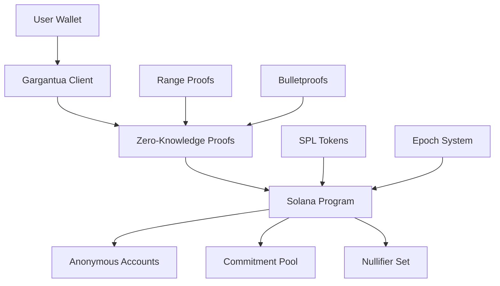

# Gargantua Protocol: Zero-Knowledge Anonymous Payments on Solana

<div align="center">
  
  
  [](https://opensource.org/licenses/Apache-2.0)
  [](https://solana.com)
  [](https://www.rust-lang.org)
  [](#security)
</div>

## 🌌 Overview

Gargantua Protocol is a cutting-edge **zero-knowledge anonymous payment system** built on Solana, providing **complete transaction privacy** without compromising on performance or decentralization. Named after the massive black hole in Interstellar, Gargantua bends the fabric of blockchain transparency to create a privacy-preserving financial universe.

### 🚀 Key Features

- **🔒 Complete Anonymity**: Hide sender, receiver, and transaction amounts
- **⚡ Solana Speed**: Sub-second transaction finality with low fees
- **🛡️ No Trusted Setup**: Transparent, trustless cryptographic foundation
- **🔗 SPL Token Compatible**: Works with any SPL token
- **📊 Scalable**: Optimized for high-throughput applications
- **🌐 Decentralized**: No central authority or coordinator required

## 🏗️ Architecture

### Core Components



### Privacy Technology Stack

1. **Pedersen Commitments**: Hide transaction amounts using elliptic curve cryptography
2. **Bulletproofs**: Prove amounts are within valid ranges without revealing values
3. **Schnorr Signatures**: Authenticate users without linking identities
4. **Nullifiers**: Prevent double-spending while maintaining anonymity
5. **Epoch System**: Batch transactions for enhanced privacy and efficiency

## 🔬 How It Works

### 1. Account Registration
Users register anonymous accounts using Schnorr signatures, creating unlinkable identities on-chain.

```rust
// Generate anonymous identity
let (private_key, public_key) = generate_keypair();
let signature = schnorr_sign(program_id, private_key);
register_account(public_key, signature);
```

### 2. Private Deposits
Deposit tokens into the anonymous pool using Pedersen commitments to hide amounts.

```rust
// Create commitment: g^amount * h^randomness
let commitment = pedersen_commit(amount, randomness);
deposit_tokens(commitment, amount); // Amount visible only during deposit
```

### 3. Anonymous Transfers
Transfer tokens between anonymous accounts without revealing any transaction details.

```rust
// Generate zero-knowledge proof
let proof = generate_transfer_proof(
    sender_commitment,
    receiver_commitment,
    amount,
    randomness
);
anonymous_transfer(proof, nullifier);
```

### 4. Private Withdrawals
Withdraw tokens from anonymous accounts with zero-knowledge proofs of ownership.

```rust
// Prove ownership and sufficient balance
let burn_proof = generate_burn_proof(account_commitment, amount);
withdraw_tokens(burn_proof, amount);
```

## 🛠️ Technical Specifications

### Cryptographic Primitives

| Component | Implementation | Security Level |
|-----------|---------------|----------------|
| **Elliptic Curve** | Ristretto255 | 128-bit |
| **Hash Function** | SHA-256 | 256-bit |
| **Commitments** | Pedersen | Information-theoretic hiding |
| **Range Proofs** | Bulletproofs | 32-64 bit ranges |
| **Signatures** | Schnorr | 128-bit security |

### Performance Metrics

| Metric | Value | Notes |
|--------|-------|-------|
| **Transaction Time** | <1 second | Solana finality |
| **Proof Generation** | ~100ms | Client-side |
| **Proof Verification** | ~10ms | On-chain |
| **Storage per Account** | 129 bytes | Minimal footprint |
| **Gas Cost** | ~0.001 SOL | Highly optimized |

### Scalability Features

- **Batch Processing**: Multiple transactions per epoch
- **Optimized Curve Operations**: Precomputed tables and caching
- **Constraint System Verification**: R1CS for complex proofs
- **Memory Efficient**: Minimal on-chain storage requirements

## 🚀 Getting Started

### Prerequisites

- Rust 1.70+
- Solana CLI 1.17+
- Node.js 16+ (for client SDK)

### Installation

```bash
# Clone the repository
git clone https://github.com/your-org/gargantua-protocol
cd gargantua-protocol

# Build the program
cargo build-bpf

# Deploy to devnet
solana program deploy target/deploy/zerosol_solana.so --url devnet
```

### Quick Start Example

```rust
use gargantua_sdk::*;

#[tokio::main]
async fn main() -> Result<()> {
    // Initialize client
    let client = GargantuaClient::new("https://api.devnet.solana.com")?;
    
    // Register anonymous account
    let account = client.register_account().await?;
    println!("Anonymous account: {}", account.public_key());
    
    // Deposit tokens
    let deposit_tx = client.deposit(account, 1000).await?;
    println!("Deposited 1000 tokens: {}", deposit_tx);
    
    // Anonymous transfer
    let recipient = PublicKey::from_str("...")?;
    let transfer_tx = client.transfer(account, recipient, 500).await?;
    println!("Anonymous transfer: {}", transfer_tx);
    
    Ok(())
}
```

## 📚 Documentation

- [**API Reference**](./docs/API.md) - Complete API documentation
- [**Protocol Specification**](./docs/PROTOCOL.md) - Technical protocol details
- [**Security Analysis**](./docs/SECURITY.md) - Cryptographic security proofs
- [**Integration Guide**](./docs/INTEGRATION.md) - How to integrate Gargantua
- [**Examples**](./examples/) - Code examples and tutorials

## 🔐 Security

### Cryptographic Guarantees

- **Anonymity**: Transactions are unlinkable to user identities
- **Untraceability**: Transaction flows cannot be followed
- **Non-repudiation**: Valid proofs cannot be forged
- **Double-spend Protection**: Nullifiers prevent replay attacks

## 🌟 Use Cases

### DeFi Applications
- **Private DEX Trading**: Trade without revealing positions
- **Anonymous Lending**: Borrow/lend with complete privacy
- **Private Yield Farming**: Earn yields anonymously

### Enterprise Solutions
- **Payroll Privacy**: Pay employees without revealing salaries
- **Supply Chain Finance**: Private B2B payments
- **Confidential Transactions**: Enterprise-grade privacy

### Individual Privacy
- **Personal Finance**: Keep transactions private
- **Donations**: Anonymous charitable giving
- **Savings**: Private wealth accumulation

## 🛣️ Roadmap

### Core Protocol (✅ Complete)
- [x] Basic anonymous transfers
- [x] Bulletproof integration
- [x] Solana deployment
- [x] SDK development


## 🤝 Contributing

We welcome contributions from the community! Please see our [Contributing Guide](./CONTRIBUTING.md) for details.

### Development Setup

```bash
# Install dependencies
cargo install --version 1.17.0 solana-cli
rustup component add rustfmt clippy

# Run tests
cargo test

# Format code
cargo fmt

# Lint code
cargo clippy
```

## 📄 License

This project is licensed under the Apache License 2.0 - see the [LICENSE](LICENSE) file for details.

---

<div align="center">
  <strong>🌌 Enter the Event Horizon of Private Finance 🌌</strong>
  <br>
  <em>Where transactions disappear into the darkness, but your wealth remains secure.</em>
</div>